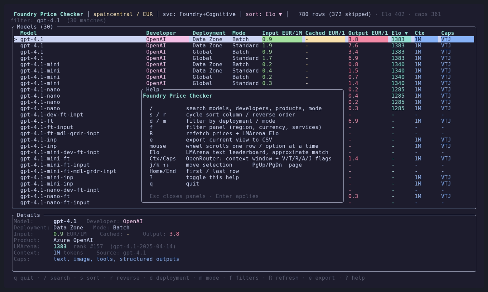

# Foundry Price Checker

A tiny terminal UI to **search, compare and sort Azure AI Foundry model prices**, enriched with
context window, capabilities and an intelligence (Elo) rating.

Prices come from the [Azure Retail Prices API](https://learn.microsoft.com/rest/api/cost-management/retail-prices/azure-retail-prices),
intelligence from the [LMArena](https://lmarena.ai) leaderboard, and context/capabilities from the
[OpenRouter](https://openrouter.ai) models API.


## Features

- Per-model prices normalised to **per 1M tokens**: input, cached input and output.
- Filter by **region**, **currency** and **service** (Foundry Models / Cognitive Services).
- **Search** across model, developer, product, deployment and mode.
- **Sort** any column; filter by deployment and mode.
- **Elo** rating from LMArena (text leaderboard).
- **Context window** and **capabilities** (`V`ision, `T`ools, `R`easoning, `A`udio, `J`SON).
- Export the current view to CSV, or dump the full table non-interactively for scripting.
- Mouse wheel scrolls one row at a time.

## Install

Requires [Rust](https://rustup.rs) 1.88 or newer.

```bash
git clone https://github.com/<you>/FoundryPriceChecker.git
cd FoundryPriceChecker
cargo build --release
./target/release/foundry-price-tui
```

Or install it on your `PATH`:

```bash
cargo install --path .
foundry-price-tui
```

## Usage

```bash
# defaults: region spaincentral, currency EUR, both services
foundry-price-tui

# pick a region/currency (also changeable in the TUI with `f`)
foundry-price-tui --region westeurope --currency USD

# limit to one service (repeatable)
foundry-price-tui --service "Foundry Models"

# skip the external metadata lookups
foundry-price-tui --no-arena --no-caps
```

### Non-interactive

```bash
# print the whole table as CSV to stdout
foundry-price-tui --dump > prices.csv

# same, without the LMArena/OpenRouter lookups
foundry-price-tui --dump --no-arena --no-caps
```

`--dump` writes columns: `model, developer, deployment, mode, input_per_1M,
cached_input_per_1M, output_per_1M, elo, context_window, capabilities, caps_source,
arena_model, product`.

### Options

| Flag | Description |
| --- | --- |
| `--region <REGION>` | Azure region to price (default `spaincentral`). |
| `--currency <CODE>` | Currency code (default `EUR`). |
| `--service <NAME>` | `serviceName` to include, repeatable. Defaults to all curated services. |
| `--dump` | Print the price table to stdout and exit (no TUI). |
| `--no-arena` | Skip the LMArena Elo lookup. |
| `--no-caps` | Skip the OpenRouter context/capabilities lookup. |

## Keys

| Key | Action |
| --- | --- |
| `/` | Search (type to filter, `Enter` accept, `Esc` clear) |
| `j` / `k`, `↑` / `↓` | Move selection |
| `PgUp` / `PgDn`, `Home` / `End` | Page / jump |
| `s` / `r` | Cycle sort column / reverse order |
| `d` / `m` | Filter by deployment / mode |
| `f` | Filter panel (region, currency, services) |
| `R` | Refetch prices + metadata |
| `e` | Export current view to `model_prices_<timestamp>.csv` |
| `?` | Help |
| `q` | Quit |
| Mouse wheel | Scroll one row/option at a time |



## Columns

| Column | Meaning |
| --- | --- |
| Model | Model name parsed from the Azure meter. |
| Developer | Vendor (OpenAI, Microsoft, DeepSeek, Meta, xAI, …). |
| Deployment | Global / Data Zone / Regional / Standard. |
| Mode | Standard or Batch. |
| Input / Cached / Output | Price per 1M tokens in the selected currency. |
| Elo | LMArena text-leaderboard rating. |
| Ctx | Context window (`400K`, `1M`, …). |
| Caps | `V`ision · `T`ools · `R`easoning · `A`udio · `J`SON (or `text`). |

The detail pane shows the matched LMArena and OpenRouter names so you can sanity-check the mapping.

## Data sources & caveats

- **Prices** — Azure Retail Prices API (`Consumption` meters only; non-token meters such as images
  and per-hour hosting are skipped).
- **Elo** — LMArena `lmarena-ai/leaderboard-dataset`, `text`/`overall` category (402 models).
- **Context / capabilities** — OpenRouter `/api/v1/models`.

Model-name matching to the external catalogues is **approximate and conservative**: exact and
version/date/effort variants match, but ambiguous names (e.g. `gpt-5.1-codex`) are deliberately left
blank rather than guessed. Always confirm against the matched name shown in the detail pane.

## Development

```bash
cargo fmt --check
cargo clippy --all-targets -- -D warnings
cargo test
```

### Regenerating the demo GIF

The animation above is generated with [VHS](https://github.com/charmbracelet/vhs)
from [`docs/demo.tape`](docs/demo.tape):

```bash
cargo build --release
vhs docs/demo.tape   # writes docs/demo.gif plus PNG stills
```

> Use VHS **v0.11.0**. v0.12.0 has a regression: it cancels the context before
> invoking ffmpeg, so no output is produced.

## License

MIT
